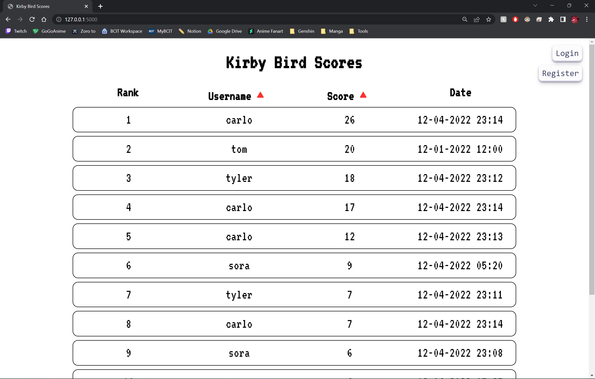
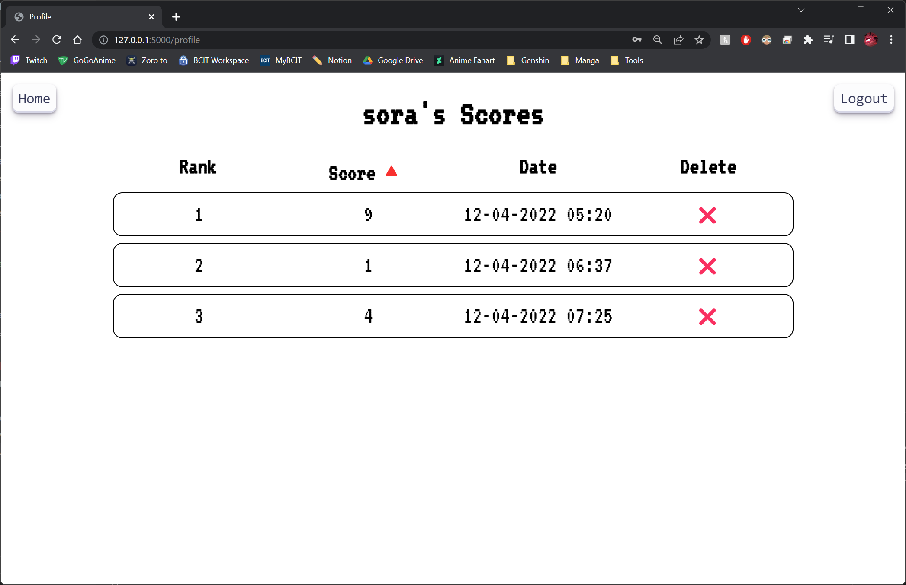

# ACIT 2515 Pygame Project

## Table of Contents

- [Kirby Bird](#kirby-bird)
    - [Login Screen](#login-screen)
    - [Home Screen](#home-screen)
    - [Play Screen](#play-screen)
    - [Game Over Screen](#game-over-screen)
- [Kirby Bird Website](#kirby-bird-website)
    - [Website Home Page](#website-home-page)
    - [Login/Register Page](#loginregister-page)
    - [Profile Page](#profile-page)

---

## **Kirby Bird**

### Login Screen

1. Enter the username for an existing account.
    - Note: You can create an acount by clicking on the link "Register Account".
2. Press the "Enter" key to type the password for the account.
    - Note: You can use a Guest Account, but you will not be able to save your score.

- Note: The arrow will indicate which input box you are typing into.

3. If the username or password is not correct it will show an error.

### Home Screen

1. You can play the game by clicking the "Start" button or click the "Exit" button to quit the game.

### Play Screen

1. Press the "Space" key to play the game. The game will not begin until the "Space" key is pressed.

2. The game will end under the following conditions:
    - Kirby touches a pipe
    - Kirby touches the top of the screen
    - Kirby touches the bottom of the screen

### Game Over Screen

1. Once the game ends, if you are signed into a account, you can submit your score.
    - Note: Press the "Enter" key to submit your score.

2. If successful, the status on the screen will be updated.

3. You can click the "Start" button to start the game again or quit the game by clicking the "Exit" button.

---

## Kirby Bird Website

### Website Home Page

1. The scoreboard for all the users are displayed here.
    - Note: The score is ordered from the highest to the lowest.

2. Clicking the "Score" button or the "Username" button will filter the list

### Login/Register Page

1. Click on the "Login" button to be redirected to the login page.

2. Enter a username and password if you have an existing account.

3. Click on the "Sign-up" ot register for an account.
    - Note: If you enter a username and password, you will be redirected to the login page.

4. Click on the "Cancel" button to be redirected back to the home page.

### Profile Page

1. You can view the list of all your submitted scores here.

2. Click on the "❌" to delete a score.
    - Note: This cannot be undone.

3. Clicking on the "Score" will filter the list of scores.

4. The "Home" button will redirect you back to the home page.
    - Note: The website will create a session so you will not have to log back in.

5. The "Logout" button will delete the current session.